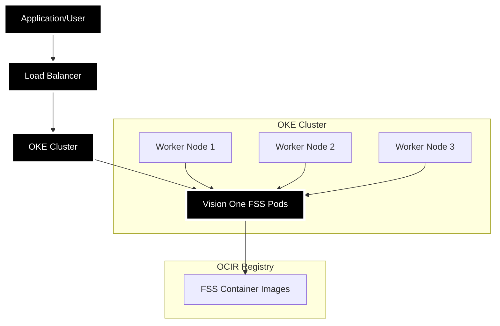

# Vision One File Security Scanner - OKE Scanning Engine

Automated deployment of Oracle Kubernetes Engine (OKE) cluster optimized for Trend Micro Vision One File Security Scanner workloads. This solution provides scalable, containerized malware scanning capabilities in Oracle Cloud Infrastructure.

## Architecture



**Components:**
- **OKE Cluster**: Managed Kubernetes service for hosting FSS containers
- **Load Balancer**: Distributes scanning requests across FSS pods
- **Vision One FSS Pods**: Containerized scanning engines with auto-scaling
- **OCIR Registry**: Private container registry for FSS images
- **Vision One API**: Cloud-based threat intelligence and scanning backend
- **Object Storage**: Stores scan results, logs, and configuration data

## Prerequisites

### Required Tools
- [Terraform](https://www.terraform.io/downloads.html) >= 1.0
- [OCI CLI](https://docs.oracle.com/en-us/iaas/Content/API/SDKDocs/cliinstall.htm) - Configured with appropriate permissions
- [kubectl](https://kubernetes.io/docs/tasks/tools/) - For cluster management (post-deployment)

### OCI Resources
- **VCN** with proper subnets (API endpoint, worker nodes, load balancer)
- **Compartment** with required permissions
- **API keys** configured for authentication

### Permissions Required
- Manage Kubernetes clusters
- Manage container repositories
- Manage IAM policies and dynamic groups
- Manage object storage buckets
- Read VCN and subnet configurations

### Vision One Requirements
- Trend Micro Vision One account
- Vision One API token with file scanning permissions
- Vision One region configuration

## Quick Start

### 1. Configure Infrastructure

Copy and edit the configuration file:

```bash
cd FileSecurity/v1-fss-oke-scanengine
cp terraform/terraform.tfvars.example terraform/terraform.tfvars
```

Edit `terraform/terraform.tfvars` with your values:

```hcl
# OCI Authentication
tenancy_ocid     = "ocid1.tenancy.oc1..your-tenancy-id"
user_ocid        = "ocid1.user.oc1..your-user-id"
fingerprint      = "your-api-key-fingerprint"
private_key_path = "/path/to/your/private/key.pem"
region           = "us-ashburn-1"

# Compartment and Networking
compartment_ocid            = "ocid1.compartment.oc1..your-compartment-id"
vcn_ocid                   = "ocid1.vcn.oc1..your-vcn-id"
api_endpoint_subnet_ocid   = "ocid1.subnet.oc1..your-api-subnet-id"
worker_node_subnet_ocid    = "ocid1.subnet.oc1..your-worker-subnet-id"
load_balancer_subnet_ocid  = "ocid1.subnet.oc1..your-lb-subnet-id"

# Optional: Cluster Configuration
cluster_name               = "fss-oke-cluster"
kubernetes_version         = "v1.28.2"
cluster_endpoint_visibility = "Private"

# Optional: Node Pool Configuration
node_pool_size             = 3
node_pool_max_size        = 10
node_shape                = "VM.Standard.E4.Flex"
node_shape_ocpus          = 2
node_shape_memory_gb      = 32
```

### 2. Deploy Infrastructure

The deployment script provides enhanced safety and usability features:

```bash
# Deploy OKE infrastructure (default operation)
./deploy.sh

# Or explicitly specify deploy
./deploy.sh deploy
```

### 3. Manage Infrastructure

```bash
# Deploy infrastructure
./deploy.sh deploy

# Plan deployment without applying changes
./deploy.sh plan

# Destroy infrastructure with safety confirmations
./deploy.sh destroy

# Destroy infrastructure without prompts (automated)
./deploy.sh destroy --force

# Get help
./deploy.sh help
```

The deployment script automatically:
- ✅ Checks prerequisites (Terraform, OCI CLI)
- ✅ Validates Terraform configuration exists
- ✅ Provides colored output for better visibility
- ✅ Shows deployment summary with resource details
- ✅ Includes safety confirmations for destroy operations

### 4. Deploy Vision One File Security Scanner

```bash
# Deploy with Vision One token (required)
V1_FSS_TOKEN='your-vision-one-token' ./deploy-v1-fss.sh install

# Remove Vision One File Security
./deploy-v1-fss.sh uninstall
```

**Enhanced LoadBalancer Detection Features:**
- 🔍 **External IP Focus** - Efficiently checks external IP/hostname assignment
- 📍 **Multi-cloud detection** - Auto-detects OCI, AWS, GCP, Azure providers
- ⏱️ **Smart timing** - Cloud-optimized timeouts (OCI: 90s, AWS: 2min, GCP/Azure: 105s)
- 🌐 **Clean URL generation** - Generates ready-to-use gRPC endpoint
- 🔍 **gRPC connectivity testing** - Verifies gRPC port accessibility when netcat is available
- 📡 **Clear endpoint display** - Shows formatted gRPC service URL for immediate use

### 5. Access Your Cluster

```bash
kubectl get nodes
kubectl get namespaces
kubectl get pods -n visionone-filesecurity
```

## What Gets Created

### Infrastructure Components

**Compute Resources:**
- OKE cluster with Kubernetes v1.28+
- Worker node pool with FSS-optimized configurations
- Auto-scaling enabled (2-10 nodes)
- VM.Standard.E4.Flex shapes (2 OCPU, 32GB RAM)

**Networking:**
- Private cluster endpoints for security
- Dedicated subnets for API endpoint, workers, and load balancers
- Security groups with minimal required access

**Storage:**
- Container registry integration with OCI Registry (OCIR)
- Object Storage buckets for scan files and results
- Persistent volumes for scanning workloads

**Security:**
- IAM dynamic groups for cluster and worker nodes
- Least-privilege policies for registry and storage access
- Network policies for pod-to-pod communication
- Image pull secrets for private registry access

### Dynamic Groups and Policies

**Dynamic Groups:**
- `fss-oke-cluster-service-group` - For cluster management operations
- `fss-oke-worker-nodes-group` - For worker node operations

**Policies:**
- Container registry access (pull/push permissions)
- Object Storage access for scan files
- Cluster lifecycle management
- Networking and load balancer management

## How It Works

1. **Infrastructure Deployment** → OKE cluster with worker nodes created
2. **FSS Container Deployment** → Vision One FSS pods deployed to cluster
3. **Load Balancer Configuration** → External access configured for scanning services
4. **Service Registration** → gRPC/ICAP endpoints exposed for client connections
5. **Auto-scaling** → Pods scale based on scanning load and resource usage
6. **Scan Processing** → Files scanned using Vision One cloud intelligence
7. **Result Delivery** → Scan results returned to clients with metadata

## Testing

### Verify Deployment
```bash
# Check cluster status
kubectl get nodes
kubectl get pods --all-namespaces

# View cluster information
kubectl cluster-info

# Check FSS namespace
kubectl get pods -n visionone-filesecurity
```

### Test Scanner Connectivity
```bash
# Check service endpoints
kubectl get svc -n visionone-filesecurity

# Test gRPC connectivity (if endpoint is available)
nc -z -w5 <EXTERNAL_IP> 50051  # gRPC port
nc -z -w5 <EXTERNAL_IP> 1344   # ICAP port
```

### Monitor Scanning Activity
```bash
# View FSS scanner logs
kubectl logs -f -n visionone-filesecurity -l app=vision-one-fss

# Monitor resource usage
kubectl top nodes
kubectl top pods -n visionone-filesecurity
```

## Troubleshooting

### Common Issues

**Deployment Failures**
- ✅ Run `./deploy.sh` to automatically check prerequisites
- ✅ Script validates Terraform and OCI CLI are installed
- ✅ Warnings shown for missing configuration values

**Cluster Access Issues**
- Verify VCN and subnet configurations
- Check security groups and route tables
- Ensure private endpoint access (VPN/bastion required for private clusters)

**FSS Scanner Issues**
- Verify Vision One API token is valid and has scanning permissions
- Check Vision One region configuration
- Ensure network connectivity to Vision One API endpoints

**LoadBalancer Detection Issues**
```bash
# Manual service status check
kubectl get svc vision-one-fss-visionone-filesecurity-scanner-lb -n visionone-filesecurity
kubectl describe svc vision-one-fss-visionone-filesecurity-scanner-lb -n visionone-filesecurity

# Check service endpoints (backend pods)
kubectl get endpoints vision-one-fss-visionone-filesecurity-scanner-lb -n visionone-filesecurity

# Verify cloud provider detection
kubectl get nodes -o jsonpath='{.items[0].spec.providerID}'
```

### Deployment Summary

After successful deployment, the script provides a summary:
```
Deployment Summary:
==========================
cluster_id: ocid1.cluster.oc1...
cluster_endpoint: https://...
node_pool_id: ocid1.nodepool.oc1...
==========================
OKE deployment complete!
```

### Monitoring and Logs

```bash
# View deployment logs
tail -f terraform/terraform.log

# Check cluster audit logs (if enabled)
oci logging search --time-start <timestamp> --log-group-id <log-group-id>

# Kubernetes troubleshooting
kubectl describe cluster
kubectl get events --sort-by=.metadata.creationTimestamp
```

## Configuration

### Cluster Settings
- **Memory**: 32 GB per worker node
- **CPU**: 2 OCPU per worker node
- **Runtime**: Kubernetes v1.28+
- **Shape**: VM.Standard.E4.Flex (flexible compute)
- **Auto-scaling**: 2-10 nodes based on workload

### Environment Variables
The FSS scanner uses these environment variables (configured during deployment):

- `V1_API_TOKEN` - Vision One API authentication token
- `V1_REGION` - Vision One region for API endpoints
- `SCANNER_CONFIG` - Scanner-specific configuration parameters

## Security

### Network Security
- Cluster uses private endpoints only
- Worker nodes in private subnets
- Minimal security group rules
- Network policies for pod isolation

### IAM Security
- Dynamic groups with instance principal authentication
- Least-privilege policy statements
- Compartment-level resource isolation
- Audit logging for all operations

### Container Security
- Private container registry (OCIR)
- Image pull secrets for authentication
- Security contexts for pod execution
- Resource limits and requests defined

## Script Features

The optimized `deploy.sh` script provides:

### ✅ Enhanced Safety
- Prerequisites validation before execution
- Double confirmation for destroy operations
- Force mode for automated destruction
- Colored output for better visibility

### ✅ Improved Usability
- Default deploy operation (no arguments needed)
- Clear help documentation
- Deployment summary with resource details
- Error handling with descriptive messages

### ✅ Better Operations
- Automatic terraform plan generation
- Clean temporary file management
- Interrupt signal handling
- Legacy option support for backward compatibility

## Infrastructure Management

**Deploy Infrastructure:**
```bash
./deploy.sh deploy  # or just ./deploy.sh
```

**Plan Infrastructure (Preview Changes):**
```bash
./deploy.sh plan
```

**Destroy Infrastructure:**
```bash
# With safety prompts
./deploy.sh destroy

# Without prompts (for automation)
./deploy.sh destroy --force
```

The destroy operation includes safety confirmations:
1. First confirmation: Type `yes` to continue
2. Final confirmation: Type `DELETE` to confirm destruction

---

For more information about Vision One File Security and OKE, visit:
- [Vision One File Security Documentation](https://docs.trendmicro.com/en-us/documentation/article/trend-vision-one-file-security)
- [Oracle Kubernetes Engine Documentation](https://docs.oracle.com/en-us/iaas/Content/ContEng/home.htm)
